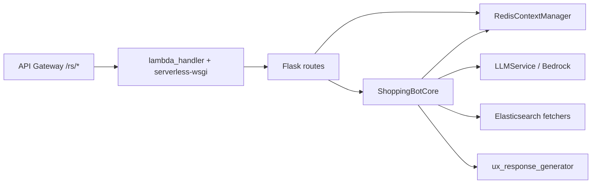

# Shopbot Service — Architecture & Workflow

A brief map of how the **Shopbot** service is structured and how a typical request flows through it.

## What it is

- **Flask** application (`shopping_bot`) that powers conversational product discovery: classification, slot-based “assessment,” Elasticsearch-backed search, and UX-shaped replies (DPL text, quick replies, product surfaces).
- Deployed on **AWS Lambda** behind API Gateway; HTTP paths are exposed under **`/rs/*`** (the app registers blueprints with `url_prefix='/rs'`).

## Entry point: Lambda

| Piece | Role |
|--------|------|
| `lambda_handler.py` | Loads secrets, builds the Flask app lazily, routes API Gateway events through **serverless-wsgi**. |
| Health | `GET /health` or `GET /rs/health` returns **200 immediately** without waiting for secrets or Redis (keeps probes fast). |
| Critical routes | Paths containing `/rs/chat`, `/rs/search`, `/rs/api/v1/products`, `/rs/flow`, `/rs/api/v1/scanner` **require secrets** (sync load + Redis host verification). |

**Secrets:** `SECRETS_MANAGER_SECRET` (default `flean-services/shopbot`) and `REDIS_SECRET_NAME` (default `flean-services/redis`). Values are merged into `os.environ` (e.g. API keys, `ES_*`, `REDIS_*`).

**App factory:** `shopping_bot.create_app(config_name)` — for Lambda, `config_name` is `lambda`: instance path uses `/tmp`, **Redis** and **ShoppingBotCore** are **lazy-initialized** on first use to avoid cold-start timeouts.

## Core building blocks

| Component | Location | Responsibility |
|-----------|----------|----------------|
| **RedisContextManager** | `redis_manager.py` | Persists **UserContext** (session, permanent, fetched_data) with TTL; debounced saves; used for conversation state and idempotency-style guards. |
| **ShoppingBotCore** | `bot_core.py` | Main orchestration: assessment continuation, follow-up vs new query, **4-intent** product handling, fetch orchestration, response assembly. |
| **LLMService** | `llm_service.py` | Bedrock-backed calls: intent/follow-up classification, assessment, delta requirements, final text, tool-style structured outputs. |
| **Data fetchers** | `data_fetchers/` | Registry maps `BackendFunction` → handlers; product search is centralized on **Elasticsearch** (`es_products`). |
| **UX layer** | `ux_response_generator.py` | After product intent classification, shapes UX (e.g. DPL, `ux_surface` SPM/MPM, quick replies). |
| **Response envelope** | `fe_payload.py` (`build_envelope`) | Normalizes chat responses for clients (WhatsApp/API). |

**Config:** `shopping_bot/config.py` — `APP_ENV` / `FLASK_ENV` selects dev/production/lambda; feature flags (e.g. `USE_COMBINED_CLASSIFY_ASSESS`, `USE_CONVERSATION_AWARE_CLASSIFIER`, `USE_TWO_CALL_ES_PIPELINE`, `ASK_ONLY_MODE`, `ENABLE_STREAMING`) steer behavior.

## HTTP surface (all under `/rs` unless noted)

- **`POST /rs/chat`** — Main conversational API (`routes/chat.py`): `user_id`, `message`, optional `session_id`, `wa_id`, `channel`, `selected_product_id` (image/selection flow).
- **`POST /rs/search`** — Direct ES search with sort/filters (`routes/simple_search.py`).
- **`GET /rs/chat/flags`**, **`GET /rs/chat/test`** — Debug/test.
- **Product / home / scanner / catalogue** — `routes/product_search.py`, `routes/home_page.py`, `routes/product_api.py` for Flutter-style APIs.
- **`/rs/flow`** (onboarding/meta) — `routes/onboarding_flow.py` (blueprint may use a different prefix; see `create_app` registrations).
- **Streaming** — `routes/chat_stream.py` registered only if `ENABLE_STREAMING` is true.
- **`/__diagnostics/<user_id>`** — Internal Redis/session snapshot (not under `/rs`).

## Chat request flow (high level)

1. **Parse JSON** → validate `user_id`, `message`.
2. **Lazy-init** Redis + `ShoppingBotCore` in Lambda via `app.extensions` helpers.
3. **Load context** — `ctx_mgr.get_context(user_id, session_id)`.
4. **Feedback shortcut** — messages starting with `/r`, `@r`, or `-r` are stored in Redis list `feedback:items` and acknowledged without running the full bot.
5. **Duplicate guard** — if `assessment.phase == "processing"`, respond **202** “already processing.”
6. **`await bot_core.process_query(message, ctx)`** — see below.
7. **Build envelope** — `build_envelope(...)` and return JSON.

## `ShoppingBotCore.process_query` (conceptual)

The engine branches roughly as follows:

1. **Ongoing assessment** — If `assessment` exists in session, **`_continue_assessment`** (collect slots, run fetchers, advance questions).
2. **Follow-up path** (unless conversation-aware flag skips it) — **`classify_follow_up`**. If it’s a follow-up and context isn’t reset, **`_handle_follow_up`**: may defer async recommendation, **memory-only** answers (references to “those / above / earlier”), **delta fetches** via `assess_delta_requirements` + `get_fetcher`, then for serious product L3 intents optionally **4-intent UX** (`classify_product_intent` → `generate_response` → `generate_ux_response_for_intent`).
3. **New query** — **`_start_new_assessment`**: can use **combined classify+assess** when enabled (`data_strategy`: `none` / `memory_only` / `es_fetch`), build **contextual questions** (multi-choice asks), or fall through to classic assessment + **`search_products`** fetch path.
4. **Serious product L3 intents** (e.g. `Product_Discovery`, `Recommendation`, `Specific_Product_Search`, `Product_Comparison`) integrate the **4-intent** UX pipeline vs generic final answers.

**Persistence:** After meaningful turns, context is **saved** back to Redis (`snapshot_and_trim` for conversation history, `last_recommendation`, etc.).

## Data & LLM

- **Products:** Elasticsearch index (`ELASTIC_INDEX`, default `products_master`), URL/key from env/secrets.
- **LLM:** Primary path is **AWS Bedrock** (`bedrock_client.py`); config still references legacy Anthropic env for compatibility.
- **Intent layers:** L1/L2/L3 style classification with mapping to `QueryIntent` and **UXIntentType**-style patterns (`is_this_good`, `which_is_better`, `show_me_alternate`, `show_me_options`).

## Mental model

This document is intentionally short; for line-level behavior, start from `shopping_bot/bot_core.py` and `shopping_bot/routes/chat.py`, then trace into `llm_service.py` and `data_fetchers/es_products.py`.
