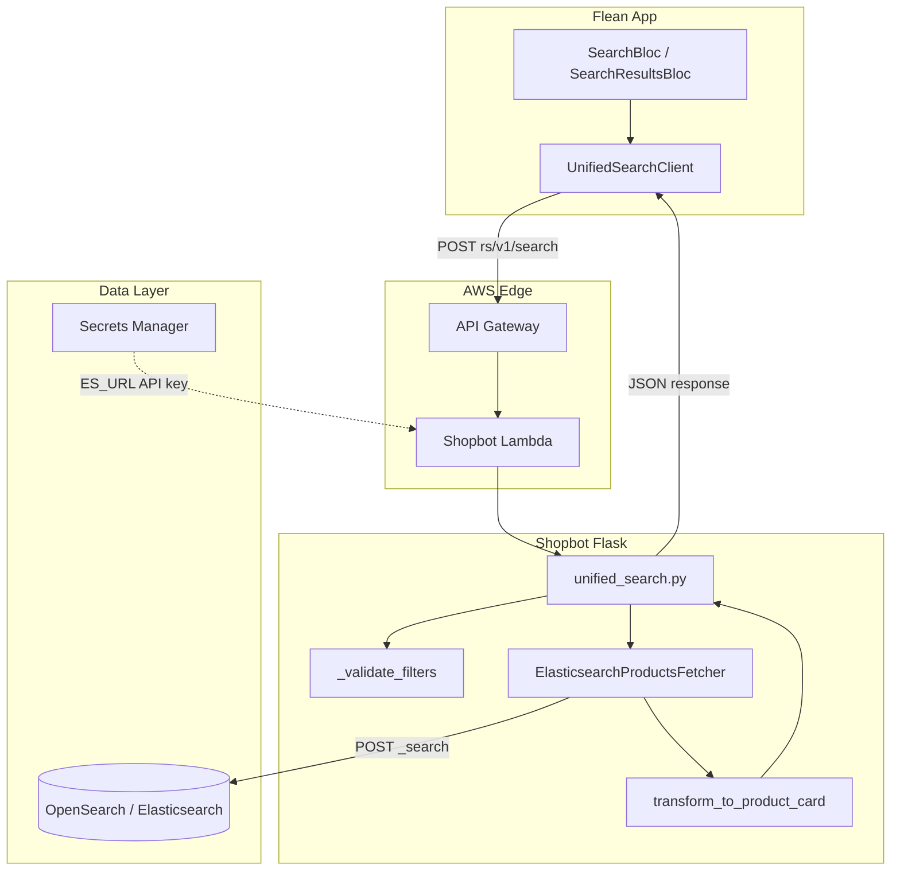
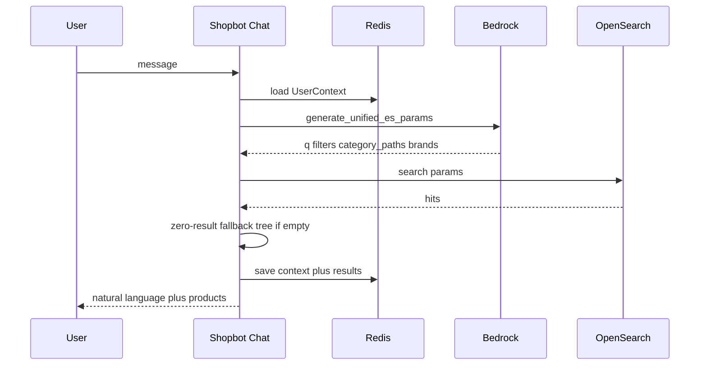

# Search Flow: User Query to Response

This document describes the end-to-end search flow in the Flean stack, from a user typing a query in the Flutter app through to the product grid response. It covers the **primary unified search path** (`POST /rs/v1/search`) and related services.

For API parameter details, see [rs-v1-search.md](./rs-v1-search.md).

---

## Services involved

| Service | Role in search |
|---------|----------------|
| **Flean App (Flutter)** | Search UI, debounced suggest, builds `UnifiedSearchRequest`, renders product cards |
| **API Gateway (AWS HTTP API)** | Public edge for `https://api.flean.ai/rs/*` |
| **Shopbot Lambda** | Flask app via `serverless-wsgi`; routes search requests |
| **AWS OpenSearch / Elasticsearch** | Product index (`products_master`); all search hits |
| **AWS Secrets Manager** | `ES_URL`, `ES_API_KEY`, Redis credentials at Lambda cold start |
| **Redis (ElastiCache)** | **Not used for search results**; session state for `/rs/chat` only |
| **AWS Bedrock** | **Not used** on direct search/suggest paths; used for `/rs/chat` and `/rs/api/v1/scanner` |
| **Ecom Service** | **Not called during search**; validates products async and writes `product_val:{pincode}:{id}` to Redis for home/PDP availability |
| **S3 (`flean-app-json`)** | Pincode mapping for home/PDP (not used by `/rs/v1/search` today) |



---

## Primary path: in-app text search

### 1. User action (Flutter)

**Files:** `flean-app/lib/app/modules/search/`

| Step | Component | What happens |
|------|-----------|--------------|
| User types query | `SearchBloc` | Debounced suggest via `SearchQueryChangedEvent` |
| User submits | `SubmitSearchEvent` | Navigates to results; `SearchResultsBloc` loads page 0 |
| Request built | `UnifiedSearchRequest` | `query`, `page`, `size`, optional `sortBy`, `filters`, `subcategory` |
| HTTP call | `UnifiedSearchClientImpl` | `POST {homeServiceBaseUrl}rs/v1/search` |
| Base URL | `EnvironmentManager.getHomeServiceBaseUrl()` | Production: `https://api.flean.ai/` |
| Response mapped | `UnifiedSearchMapper` | → `UnifiedSearchResultEntity` / product grid cards |

**Note on pincode:** The app includes `pincode` in the POST body when the user has an address (`UnifiedSearchRequest.toJson()`). **Shopbot `/rs/v1/search` currently ignores pincode** — search results are not filtered by Redis validation cache. Availability is determined later on PDP or home feeds.

### 2. API Gateway → Lambda

**File:** `shopbot/lambda_handler.py`

```
API Gateway event
  → lambda_handler()
  → Health fast-path for GET /rs/health (skip full init)
  → get_app(require_secrets=False) for most routes
  → serverless_wsgi.handle_request(app, event, context)
  → Flask routes to blueprint handler
```

Search routes are registered under prefix `/rs` in `shopping_bot/__init__.py`:

- `unified_search` blueprint → `/rs/v1/search`, `/rs/v1/search/suggest`, `/rs/v2/search/suggest`
- Legacy: `simple_search`, `product_api`, `product_search`, `home_page`

### 3. Route handler: `unified_search()`

**File:** `shopbot/shopping_bot/routes/unified_search.py`

| Step | Action |
|------|--------|
| Parse input | GET query string or POST JSON body |
| Validate presence | At least one of `query`, `subcategory`, or `filters` required |
| Resolve sort | `_resolve_sort()` — default `relevance` when query present, else `flean_score_desc`; aliases `sort=flean_score` → `flean_score_desc`, `sort=price` → `price_asc` |
| Normalize filters | `_normalize_filter_aliases()` — `preferences` → `ingredient_preferences`, `dietary` → `dietary_preferences` |
| Validate filters | `_validate_filters()` from `product_api.py` |
| Fetch | `get_es_fetcher().search_products_unified(...)` |
| Transform hits | Each ES `_source` → `transform_to_product_card()` |
| Respond | `{ success: true, data: { products: [...] }, meta: {...} }` |

**Error responses (4xx/5xx):**

| Code | When |
|------|------|
| `MISSING_PARAMETER` | No query, subcategory, or filters |
| `INVALID_SORT` | Unknown `sort_by` |
| `INVALID_FILTERS` | Bad filter shape or values |
| `SEARCH_ERROR` | ES returned error in meta |
| `INTERNAL_ERROR` | Unhandled exception or ES misconfiguration |

### 4. Elasticsearch query: `search_products_unified()`

**File:** `shopbot/shopping_bot/data_fetchers/es_products.py`

#### 4a. Input modes

| Mode | Trigger | ES query shape |
|------|---------|----------------|
| **Text search** | `query` non-empty | `bool` with `must` text clauses + `filter` |
| **Browse subcategory** | `subcategory` path | Filters on `category_paths` (term + wildcard) |
| **Filter-only** | `filters` only, no query | `match_all` + filters |
| **Combined** | Any mix | Text + subcategory + filters |

#### 4b. Always-applied filters

- **Visibility:** `visibility` in `visible`, `soft` (`VISIBILITY_FILTER`)
- **User filters** via `_build_filter_clauses()`:
  - `price_range` — bucket keys (`below_99`, `100_249`, …)
  - `flean_score` — Painless script on `flean_score.adjusted_score_label`
  - `ingredient_preferences` — terms on `category_data.tags.ingredient_tags`
  - `dietary_preferences` — terms on `category_data.tags.dietary_tags`
  - `food_type` — veg / nonveg description rules
  - `nutrition` — protein gte, carbs/fat lte sliders
  - `nutrition_profiles` — percentile ranges (`high_protein`, `low_sugar`, …)

#### 4c. Text scoring (when `query` present)

1. Tokenize query; build n-gram phrase boosts on `name`, `brand`, `description`
2. `multi_match` with fuzziness tuned by token count
3. Optional **phonetic fields** when `SEARCH_UNIFIED_PHONETIC_ENABLED`
4. Optional **Flean relevance boost** — `function_score` multiplying `_score` by normalized `flean_score.adjusted_score_label` when `SEARCH_RELEVANCE_FLEAN_BOOST_ENABLED`
5. **`min_score`** threshold by query length to drop weak matches

#### 4d. Sorting

Built by `_build_sort_config(sort_by)`:

| `sort_by` | ES sort |
|-----------|---------|
| `relevance` | `_score` desc |
| `price_asc` / `price_desc` | `price` |
| `protein_desc` / `fiber_desc` / `fat_asc` | Painless script on nutri fields |
| `flean_score_desc` | `stats.adjusted_score_percentiles.subcategory_percentile` desc, then `_score` |

#### 4e. Zero / weak hit fallbacks

If the primary query returns too few or weak results:

1. **Guarded fuzzy fallback** — bounded fuzzy `multi_match` (`GUARDED_FUZZY_FALLBACK_ENABLED`)
2. **Prefix / wildcard fallback** — token prefix queries on name/brand

Meta flags: `fuzzy_fallback_used`, `prefix_fallback_used`, `phonetic_used`, `relevance_flean_boost_applied`.

#### 4f. Pagination

- `from = page * size`, `size` clamped 1–100
- `track_total_hits: true` → `meta.total`, `meta.total_pages`, `meta.has_next`, `meta.has_prev`

### 5. Product card transformation

**Function:** `transform_to_product_card()` in `es_products.py`

Maps ES `_source` to the **standard listing card** used across search, catalogue, home, and scanner:

```json
{
  "id", "name", "brand", "price", "mrp", "currency", "qty", "size",
  "visibility", "image_url", "macro_tags", "nutrition", "flean_score",
  "flean_percentile", "in_stock": true
}
```

Listing cards set `in_stock: true` by default (ES visibility is not propagated as false on grid cards).

### 6. Response to client

**HTTP 200 example shape:**

```json
{
  "success": true,
  "data": {
    "products": [ /* transform_to_product_card objects */ ]
  },
  "meta": {
    "total": 142,
    "page": 0,
    "size": 20,
    "total_pages": 8,
    "has_next": true,
    "has_prev": false,
    "query": "protein bar",
    "subcategory": null,
    "sort_by": "relevance",
    "filters_applied": { },
    "took_ms": 45,
    "fuzzy_fallback_used": false,
    "prefix_fallback_used": false
  }
}
```

Flutter maps this to grid UI; pagination loads `page + 1` on scroll.

---

## Autocomplete / suggest flow

| Endpoint | App usage | Response |
|----------|-----------|----------|
| `POST /rs/v2/search/suggest` | Search screen as user types | Suggestions grouped by brand (max 3 brands × 3 products) |
| `POST /rs/v1/search/suggest` | Legacy flat list | `{ suggestions: [{ text, type, brand? }] }` |

**Backend:** `fetcher.search_suggestions(query, size)` — ES completion / prefix query on product names and brands. No LLM. Can be disabled via env `SEARCH_SUGGEST_DISABLED=1`.

---

## Alternate search entry points

These use the same ES fetcher family but different route handlers:

| Route | Handler | ES method | LLM? |
|-------|---------|-----------|------|
| `POST /rs/v1/search` | `unified_search.py` | `search_products_unified` | No |
| `GET\|POST /rs/api/v1/products` | `product_api.py` | `search_products_unified` | No |
| `GET /rs/api/v1/catalogue` | `product_api.py` | `search_by_subcategory` | No |
| `POST /rs/search` | `simple_search.py` | `search()` (legacy flat response) | No |
| `GET\|POST /rs/api/v1/products/search` | `product_search.py` | `search()` (rich legacy params) | No |
| `POST /rs/chat` | `chat.py` | `search()` via `search_products_handler` | **Yes — Bedrock** |
| `POST /rs/api/v1/scanner` | `product_api.py` | `search()` after vision extract | **Yes — Bedrock Vision** |

### Conversational search (`/rs/chat`) — high level



---

## What search does NOT do

Understanding these boundaries avoids confusion with home/PDP availability:

| Concern | Search path | Where it happens instead |
|---------|-------------|--------------------------|
| Redis validation cache | **Not read** | Home best-selling / flean-picks (`_filter_cards_with_validation_cache`) |
| Pincode canonicalization | **Not applied** on `/rs/v1/search` | Home routes, PDP (`try_resolve_canonical_pincode`) |
| Cart / checkout validation | **Not called** | Ecom service (`validate_cart_products_sync`) |
| Search result caching | **None** | Every request hits ES |

**Ecom warm path (async, not in search request path):**

1. Ecom cron/job calls `GET /rs/api/v1/home/validation-candidates`
2. Ecom validates product IDs against Blinkit/Zepto/etc.
3. Writes `product_val:{pincode}:{product_id}` to Redis
4. Home/PDP read that cache later — **not** the search listing API

---

## Configuration and auth

| Env / secret | Purpose |
|--------------|---------|
| `ES_URL` | OpenSearch cluster endpoint |
| `ELASTIC_INDEX` | Default `products_master` |
| `ES_API_KEY` / IAM (`AOSS_ENABLED`, `ES_USE_IAM`) | ES authentication |
| `SEARCH_UNIFIED_PHONETIC_ENABLED` | Phonetic field matching |
| `SEARCH_RELEVANCE_FLEAN_BOOST_ENABLED` | Flean score function_score boost |
| `GUARDED_FUZZY_FALLBACK_ENABLED` | Fuzzy retry on weak results |
| `SEARCH_SUGGEST_DISABLED` | Disable suggest endpoints |

See also: [opensearch-serverless.md](./opensearch-serverless.md), [ELASTICSEARCH_V5_MIGRATION.md](../ELASTICSEARCH_V5_MIGRATION.md).

---

## End-to-end timeline (typical text search)

```
1. User submits "high protein oats" in Flean App
2. SearchResultsBloc → UnifiedSearchRequest(query, page=0, size=20)
3. POST https://api.flean.ai/rs/v1/search
4. API Gateway → Lambda → Flask unified_search()
5. Validate filters/sort; get_es_fetcher()
6. search_products_unified():
     - bool query: multi_match + phrase boosts + visibility filter
     - optional function_score flean boost
     - sort relevance; min_score applied
     - POST {ES_URL}/products_master/_search
     - optional fuzzy/prefix fallback
7. For each hit: transform_to_product_card()
8. Return { success, data: { products }, meta }
9. UnifiedSearchMapper → entities → product grid UI
```

**Typical latency contributors:** API Gateway + Lambda cold start (if any), ES query (`took_ms` in meta), card transformation (Python loop).

---

## Related documentation

| Document | Content |
|----------|---------|
| [rs-v1-search.md](./rs-v1-search.md) | Full `/rs/v1/search` API spec |
| [SHOPBOT_WORKFLOW.md](../SHOPBOT_WORKFLOW.md) | Chat and architecture overview |
| [DEVELOPER_DOCUMENTATION.md](../DEVELOPER_DOCUMENTATION.md) | Legacy Flutter product search API |
| [Flean_HomePage_Search_APIs.postman_collection.json](../Flean_HomePage_Search_APIs.postman_collection.json) | Postman examples |
| `ecom-service/README.md` | Validation cache warm jobs |

---

## Key source files

| Area | Path |
|------|------|
| Unified search route | `shopping_bot/routes/unified_search.py` |
| ES unified search | `shopping_bot/data_fetchers/es_products.py` → `search_products_unified()` |
| Filter building | `es_products.py` → `_build_filter_clauses()` |
| Sort building | `es_products.py` → `_build_sort_config()` |
| Product cards | `es_products.py` → `transform_to_product_card()` |
| Filter validation | `shopping_bot/routes/product_api.py` → `_validate_filters()` |
| Lambda entry | `lambda_handler.py` |
| App factory / blueprints | `shopping_bot/__init__.py` |
| Flutter client | `flean-app/lib/app/modules/search/data/datasources/unified_search_client.dart` |
| Flutter API paths | `flean-app/lib/core/network/api/api_endpoints.dart` |
