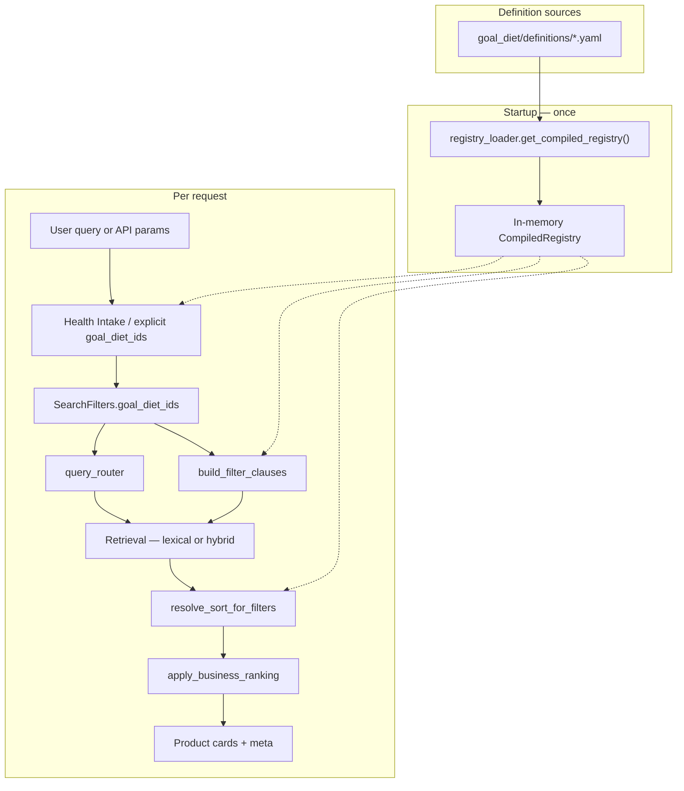
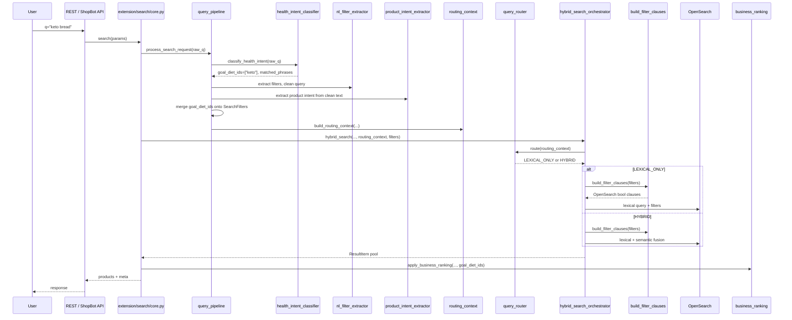
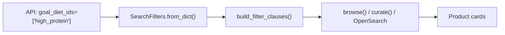
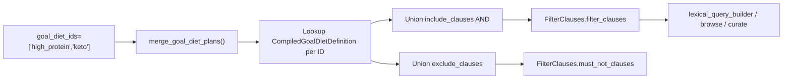
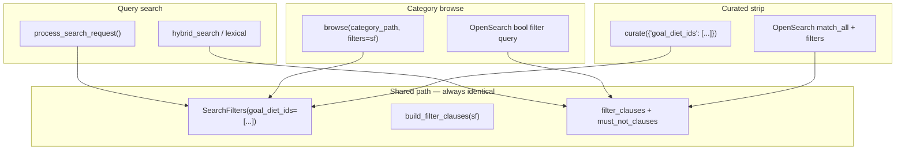
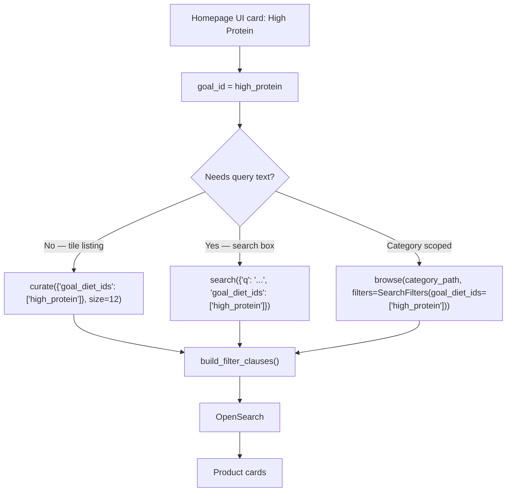
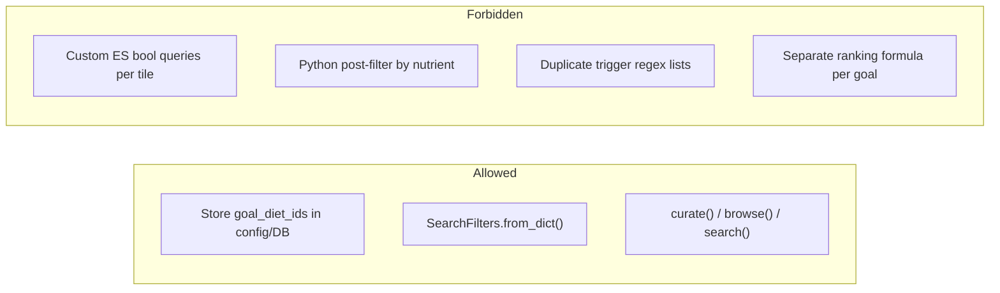

# Shop by Goal — Technical Guide

This document is the complete engineering reference for **Shop by Goal / Shop by Diet** in Search V2. It explains how goal and diet tiles are defined, detected, filtered, routed, sorted, ranked, and surfaced across every API entry point.

**Audience:** backend engineers extending goals, wiring homepage tiles, debugging retrieval, or onboarding to Search V2.

**Related code (not in this folder):**

| Module | Path | Role |
|--------|------|------|
| Registry & YAML | `search_v2/goal_diet/` | Single source of truth for definitions |
| Health Intake | `search_v2/query_processing/health_intent_classifier.py` | Query-time ID detection |
| Query pipeline | `search_v2/query_processing/query_pipeline.py` | Orchestrates understanding → filters |
| Router | `search_v2/query_processing/query_router.py` | LEXICAL vs HYBRID decision |
| Filters | `search_v2/retrieval/filters.py` | `SearchFilters`, `build_filter_clauses()` |
| Sorting | `search_v2/retrieval/sorting.py` | Goal default sort resolution |
| Ranking | `search_v2/ranking/business_ranking.py` | Post-retrieval business rules |
| Search | `search_v2/extension/search/core.py` | Query-driven search entry |
| Browse | `search_v2/extension/category_browsing/browse.py` | Category-scoped filter-only retrieval |
| Curate | `search_v2/extension/curated/curate.py` | Filter-only curated strips |

---

## 1. Overview

### What Shop by Goal is

**Shop by Goal** (and **Shop by Diet**) lets users discover products aligned with health objectives — High Protein, Keto, Gluten Free, Heart Healthy, etc. — using the **same Search V2 retrieval pipeline** as text search, category browse, and curated homepage strips.

A "goal" or "diet" is not a parallel product hierarchy. It is a **named filter preset** layered on the shared taxonomy (`category_paths`, `product_type`, percentile stats, dietary tags). Goals can combine with ordinary category scope (e.g. "Keto snacks in Chips") because both read the same indexed document fields.

### Why we introduced the Goal/Diet registry

Previously, health logic was scattered:

- Hardcoded triggers and preference tuples in `health_intent_classifier.py`
- Duplicate lifestyle patterns in `nl_filter_extractor.py`
- Percentile clauses in `_NUTRITION_PROFILE_CLAUSES`
- V1 `NUTRITION_PROFILE_FILTERS` in `es_products.py`
- Ad-hoc ranking via `health_preference_rule()`

The **Goal/Diet registry** consolidates the founder's PDF formulas into version-controlled YAML, compiled once at startup, and consumed uniformly by detection, filtering, and sorting. Business rules live in one place; code paths only carry **canonical IDs**.

### High-level architecture



### Design principles

These are **non-negotiable** constraints enforced by the implementation:

| Principle | Enforcement |
|-----------|-------------|
| **Single source of truth** | All goal/diet definitions in `search_v2/goal_diet/definitions/` |
| **One Query Understanding stage** | Health Intake in `query_pipeline.py` step 0; no parallel resolver |
| **One Router** | `query_router.py` only; hybrid orchestrator delegates to it |
| **One SearchFilters integration point** | `goal_diet_ids` on `SearchFilters`; no compiled ES clauses on filters |
| **One retrieval pipeline** | `build_filter_clauses()` → lexical/hybrid query builders / browse / curate |
| **One ranking pipeline** | `apply_business_ranking()`; goal filters replace duplicate health preference ranking |
| **No duplicated business rules** | YAML registry; not reimplemented in Python branches |
| **No duplicated trigger lists** | Registry triggers only for goal/diet ID detection |
| **Compile once, cache in memory** | Lazy singleton + eager warmup; no per-request YAML parsing |
| **Optimize for low latency** | Precompiled clauses; index-time fields preferred over script queries |

---

## 2. End-to-End Request Flow

### Text search flow



### Stage responsibilities

| Stage | Module | Responsibility | Must NOT |
|-------|--------|----------------|----------|
| **Query Understanding / Health Intake** | `health_intent_classifier.py` | Match registry triggers → `goal_diet_ids`, `matched_phrases` | Generate ES clauses, ranking preferences, or router decisions |
| **NL filter extraction** | `nl_filter_extractor.py` | Price, macros, dietary labels, exclusions from query text | Duplicate lifestyle goal triggers (removed) |
| **Product intent** | `product_intent_extractor.py` | Resolve head noun → `product_type` filter/boost | Implement goal logic |
| **SearchFilters merge** | `query_pipeline.py`, `merge_filters()` | Union `goal_diet_ids`; explicit API params win on overlap | Expand IDs to ES clauses |
| **Router** | `query_router.py` | LEXICAL_ONLY vs HYBRID | Build filters or detect goals |
| **build_filter_clauses()** | `filters.py` | Translate `goal_diet_ids` → OpenSearch `filter` / `must_not` | Parse YAML or detect triggers |
| **Retrieval** | `hybrid_search_orchestrator.py`, `browse.py`, `curate.py` | Execute OpenSearch query with clauses | Own goal/diet rule definitions |
| **Sorting** | `sorting.py` | Explicit `sort_by` wins; else goal default from registry | Define sort rules per API |
| **Ranking** | `business_ranking.py` | Flean score, freshness, etc.; skip `health_preference_rule` when goals active | Re-apply goal inclusion/exclusion |
| **Response** | `to_product_card()` | Normalize hits to product cards | Filter products post-hoc for goal membership |

### Filter-only flow (browse / curate / homepage tile)

When there is **no query text**, Health Intake is skipped. The caller passes `goal_diet_ids` directly:



---

## 3. Registry

### Folder structure

```
search_v2/goal_diet/
├── __init__.py              # Public exports
├── types.py                 # CompiledGoalDietDefinition, CompiledRegistry, MergedGoalDietPlan
├── registry_loader.py       # Load YAML → validate → compile → cache
├── merge.py                 # merge_goal_diet_plans() — single merge implementation
└── definitions/
    ├── _fields.yaml         # Shared ES field reference (documentation)
    ├── goals/
    │   ├── high_protein.yaml
    │   ├── weight_loss.yaml
    │   ├── muscle_gain.yaml
    │   ├── gut_health.yaml
    │   ├── heart_healthy.yaml
    │   ├── energy_focus.yaml
    │   ├── immunity.yaml
    │   └── clean_eating.yaml
    └── diets/
        ├── keto.yaml
        ├── vegan.yaml
        ├── vegetarian.yaml
        ├── gluten_free.yaml
        ├── dairy_free.yaml
        ├── diabetic_friendly.yaml
        ├── low_sugar.yaml
        ├── high_fiber.yaml
        ├── low_sodium.yaml
        ├── low_fat.yaml
        ├── kids_friendly.yaml
        ├── millet_based.yaml
        └── nut_free.yaml
```

**20 tiles today:** 8 goals + 12 diets (plus `_fields.yaml` reference doc).

### YAML schema

Each tile file defines:

| Field | Required | Description |
|-------|----------|-------------|
| `id` | Yes | Canonical snake_case ID (e.g. `high_protein`, `keto`) |
| `kind` | Yes | `"goal"` or `"diet"` |
| `display_name` | Yes | Human label for UI |
| `triggers` | Yes | Phrases for Health Intake (word-boundary regex) |
| `filters.include` | Yes | List of inclusion rules → ES `filter` clauses |
| `filters.exclude` | No | List of exclusion rules → ES `must_not` clauses |
| `sort` | No | Default sort key (must exist in `sorting.SORT_SPECS`) |

**Supported filter entry types** (compiled by `registry_loader._compile_filter_entry()`):

```yaml
# Percentile / numeric range
- range:
    stats.protein_percentiles.subcategory_percentile:
      gte: 75

# Dietary tag (maps to dietary_tags + dietary_tags.keyword)
- dietary_tag: vegan

# Ingredient tag
- ingredient_tag: millet

# Raw OpenSearch term / match_phrase (advanced)
- term:
    field.name: value
```

### Example: Goal YAML (`high_protein.yaml`)

```yaml
id: high_protein
kind: goal
display_name: High Protein
triggers:
  - high protein
  - protein rich
  - protein packed
  - gym
  - post workout
  - pre workout
filters:
  include:
    - range:
        stats.protein_percentiles.subcategory_percentile:
          gte: 75
  exclude: []
sort: protein
```

### Example: Diet YAML (`keto.yaml`)

```yaml
id: keto
kind: diet
display_name: Keto
triggers:
  - keto
  - ketogenic
  - low carb
filters:
  include:
    - range:
        stats.carbs_penalty_percentiles.subcategory_percentile:
          lte: 50
    - range:
        stats.healthy_fat_percentiles.subcategory_percentile:
          gte: 75
  exclude: []
sort: fat
```

### Registry compilation

On first call to `get_compiled_registry()`:

1. Glob all `definitions/goals/*.yaml` and `definitions/diets/*.yaml`
2. Parse each file with `yaml.safe_load()`
3. Validate required fields (`id`, `kind`, `triggers`, `filters.include`)
4. Compile trigger strings → `re.Pattern` objects
5. Compile filter entries → OpenSearch clause dicts
6. Build `trigger_index` sorted **longest phrase first** (so `"high protein"` wins over `"protein"`)
7. Store in module-level `_compiled_registry_cache`

```python
# search_v2/goal_diet/registry_loader.py
_compiled_registry_cache: Optional[CompiledRegistry] = None

def get_compiled_registry(*, force_reload: bool = False) -> CompiledRegistry:
    global _compiled_registry_cache
    if _compiled_registry_cache is not None and not force_reload:
        return _compiled_registry_cache
    _compiled_registry_cache = _compile_registry()
    return _compiled_registry_cache
```

**There is exactly one `yaml.safe_load` call site in the repository** — inside `_compile_registry()`. Request handlers never parse YAML.

### Caching and warmup

| When | What happens |
|------|--------------|
| **First `get_compiled_registry()` call** | Compile all YAML → cache (any entry point: search, browse, tests) |
| **Gunicorn startup** | `shopping_bot/__init__.py` → `search_v2.extension.search.warmup()` → `_build_search()` eagerly calls `get_compiled_registry()` |
| **Lambda / lazy cold start** | First search request pays compile cost once; subsequent requests use cache |
| **Tests** | `get_compiled_registry(force_reload=True)` to pick up YAML edits |

Pattern mirrors `load_scoring_rules()` in `business_ranking.py`.

### Merge logic

`merge_goal_diet_plans(ids)` in `search_v2/goal_diet/merge.py` is the **only** merge implementation:

| Dimension | Semantics |
|-----------|-----------|
| **Inclusion filters** | AND — product must satisfy all selected goals/diets |
| **Exclusion filters** | Union — exclude if any tile excludes |
| **Default sort** | First tile in ID list that defines a `sort` wins |
| **Duplicate clauses** | Deduplicated by stable clause key |

Called exclusively from `build_filter_clauses()` when `sf.goal_diet_ids` is set.

### Default sorting

Each tile may set `sort:` to a key in `search_v2/retrieval/sorting.py` → `SORT_SPECS` (e.g. `protein`, `low_sugar`, `quality`, `fat`).

At runtime, `resolve_sort_for_filters(explicit_sort, goal_diet_ids)` returns:

1. Explicit user/API `sort_by` if set and not `"relevance"`
2. Else `merge_goal_diet_plans(ids).default_sort`
3. Else `None` (OpenSearch relevance / `_score`)

### Why YAML over hardcoded Python

| YAML | Hardcoded Python |
|------|------------------|
| Founder/product can review diffs without reading retrieval code | Rules buried in `if goal == "keto"` branches |
| Add a tile without touching router, ranking, or retrieval | Every new tile risks merge conflicts across modules |
| Split files per tile scale to dozens of goals | Monolithic dict becomes unmaintainable |
| Compiled once — zero runtime parse cost | Same if compiled, but harder for non-engineers to edit |

---

## 4. Query Understanding

### Health Intake

**Module:** `search_v2/query_processing/health_intent_classifier.py`

**Function:** `classify_health_intent(raw_query: str) -> HealthIntentResult`

Runs as **step 0** in `query_pipeline.py`, on the **raw query** before NL extraction strips phrases:

```python
health_intent = classify_health_intent(raw_query)
# ...
if health_intent.detected:
    intake_filters = SearchFilters(goal_diet_ids=list(health_intent.goal_diet_ids))
    nl_filters = merge_filters(intake_filters, nl_filters)
```

### Trigger detection

1. Load compiled `registry.trigger_index`
2. For each `(pattern, definition_id, trigger_phrase)` — longest triggers first
3. If `pattern.search(query)` matches and ID not yet seen → record ID + phrase
4. If no exact match → fuzzy token-window fallback against registry triggers only

### Output shape

```python
@dataclass(frozen=True)
class HealthIntentResult:
    detected: bool = False
    goal_diet_ids: Tuple[str, ...] = ()
    matched_phrases: Tuple[str, ...] = ()
```

Example: `"keto bread"` → `goal_diet_ids=("keto",)`, `matched_phrases=("keto",)`.

### What this layer MUST NOT do

- ❌ Build OpenSearch filter clauses
- ❌ Set `nutrition_profiles`, `macro_filters`, or `dietary_labels` (unless separately extracted by NL)
- ❌ Emit `primary_preferences` / `secondary_preferences` for ranking
- ❌ Decide LEXICAL vs HYBRID routing
- ❌ Choose sort order

Detection only. All side effects happen downstream via `SearchFilters.goal_diet_ids`.

### Interaction with typo correction

`typo_correction.py` adds registry trigger words to the protected-word set via `get_all_triggers()` so health phrases like `"muscle gain"` are not "corrected" away:

```python
from search_v2.goal_diet.registry_loader import get_all_triggers
for trigger in get_all_triggers():
    words.update(_words_in(trigger))
```

### Interaction with NL filter extraction

| NL extractor | Health Intake | Notes |
|--------------|---------------|-------|
| `"high protein bread"` → macro filter + clean `"bread"` | Also detects `high_protein` goal ID | Both may apply; macro can force HYBRID via `has_nutritional_constraint` |
| `"keto bread"` → `dietary_labels: ["KETO"]` | Also detects `keto` goal ID | **Known overlap:** duplicate dietary-tag clauses (see §15) |
| Lifestyle patterns (`gym`, `weight loss`) | Removed from NL | Now registry triggers only |

NL macro patterns (`_MACRO_PATTERNS`) and dietary patterns (`_DIETARY_PATTERNS`) still exist for **numeric constraints** and **dietary label** extraction — they are not goal ID trigger lists.

---

## 5. SearchFilters

### `goal_diet_ids`

```python
# search_v2/retrieval/filters.py
@dataclass
class SearchFilters:
    ...
    goal_diet_ids: Optional[List[str]] = None
```

Canonical list of registry IDs active for this request. Set by:

- Health Intake (query search)
- Explicit API params (`goal_diet_ids`, `goal_ids`, `diet_ids`)
- Legacy shim from `nutrition_profiles`

**Never** stores compiled OpenSearch clauses.

### Merge behaviour

`merge_filters(base, overlay)` unions list fields including `goal_diet_ids`:

```python
goal_diet_ids=_merge_list(base.goal_diet_ids, overlay.goal_diet_ids),
```

In `query_pipeline.py`, explicit API filters (`base`) win on scalar overlap; list fields are deduplicated union.

### Backward compatibility

Existing APIs accept `nutrition_profiles`:

```python
# POST / search params
{"nutrition_profiles": ["high_protein", "low_sugar"]}
```

`SearchFilters.from_dict()` maps known profiles to `goal_diet_ids` via `NUTRITION_PROFILE_TO_GOAL_DIET`:

| `nutrition_profiles` value | Maps to `goal_diet_id` |
|------------------------------|------------------------|
| `high_protein` | `high_protein` |
| `high_fiber` | `high_fiber` |
| `low_carb` | `keto` |
| `low_sugar` | `low_sugar` |
| `low_sodium` | `low_sodium` |
| `low_fat` | `low_fat` |

Unmapped profiles remain on legacy `nutrition_profiles` field and use `_NUTRITION_PROFILE_CLAUSES` — no double-filtering for mapped values.

---

## 6. Filter Generation

### Single translation layer

`build_filter_clauses(sf: SearchFilters)` in `filters.py` is the **only** place goal IDs become OpenSearch clauses:

```python
if sf.goal_diet_ids:
    from search_v2.goal_diet.merge import merge_goal_diet_plans
    merged_plan = merge_goal_diet_plans(sf.goal_diet_ids)
    fc.extend(merged_plan.filter_clauses)
    mn.extend(merged_plan.must_not_clauses)
```

### Transformation pipeline



### Example: `high_protein`

**Input:** `SearchFilters(goal_diet_ids=["high_protein"])`

**Output filter clause:**

```json
{
  "range": {
    "stats.protein_percentiles.subcategory_percentile": {"gte": 75}
  }
}
```

### Example: `keto`

**Output filter clauses (AND):**

```json
{"range": {"stats.carbs_penalty_percentiles.subcategory_percentile": {"lte": 50}}}
{"range": {"stats.healthy_fat_percentiles.subcategory_percentile": {"gte": 75}}}
```

These attach to the OpenSearch `bool.filter` array alongside product-type, price, and category clauses.

---

## 7. Router

**Module:** `search_v2/query_processing/query_router.py`

**Single decision function:** `route(context, settings) -> "LEXICAL_ONLY" | "HYBRID"`

Invoked from `hybrid_search_orchestrator.py` — nowhere else makes routing decisions.

### Decision order

```python
1. has_nutritional_constraint          → HYBRID
2. goal_diet_detected + strong product → LEXICAL_ONLY
3. goal_diet_detected alone            → HYBRID
4. has_fresh_produce_match             → LEXICAL_ONLY
5. category_fallback product intent    → LEXICAL_ONLY
6. head_term + high confidence/compound → LEXICAL_ONLY
7. default                             → HYBRID
```

`goal_diet_detected` is set in `routing_context.py` when Health Intake fires or `SearchFilters.goal_diet_ids` is non-empty. Goal IDs do **not** set `has_nutritional_constraint` (that flag is only `macro_filters` or legacy `nutrition_profiles`).

### Strong product intent

```python
def _strong_product_intent(context, settings) -> bool:
    if context.product_intent_source == "category_fallback":
        return True
    if context.product_intent_source == "head_term" and (
        context.product_intent_is_compound
        or context.product_intent_confidence >= settings.ROUTER_CONFIDENCE_THRESHOLD
    ):
        return True
    return False
```

### Worked examples (traced against real lexicon)

| Query | Goal IDs | Product intent | Router | Why |
|-------|----------|----------------|--------|-----|
| **keto bread** | `keto` | `bread` (high filter) | **LEXICAL_ONLY** | Goal + strong product intent |
| **vegan milk** | `vegan` | `milk` (category_fallback boost) | **LEXICAL_ONLY** | Goal + category_fallback = strong |
| **heart healthy foods** | `heart_healthy` | none | **HYBRID** | Goal only, no product gate |
| **healthy snacks** | none | none | **HYBRID** | No registry trigger; default fallback |
| **low sugar biscuits** | `low_sugar` | `biscuits` (boost) | **HYBRID** | `macro_filters` → nutritional constraint |
| **bread** | none | `bread` (high filter) | **LEXICAL_ONLY** | Unchanged product-intent routing |
| **oats** | none | `oats` (boost) | **LEXICAL_ONLY** | Unchanged product-intent routing |

### Lexical phrase stripping

When goals are detected, `health_intent_matched_phrases` is passed to `lexical_query_builder._core_text()` so `"keto bread"` searches lexically for `"bread"` while goal filters gate the pool.

---

## 8. Sorting

**Module:** `search_v2/retrieval/sorting.py`

### Resolution

```python
def resolve_sort_for_filters(sort_by, goal_diet_ids):
    if sort_by and sort_by not in ("", "relevance"):
        return sort_by  # explicit wins
    return get_default_sort_for_goal_diet_ids(goal_diet_ids)
```

### Precedence

1. **Explicit** user/API `sort_by` (e.g. `price_asc`, `flean_score_desc`)
2. **Goal default** from first matching tile in merged plan
3. **`None`** → OpenSearch `_score` / relevance

### Browse / search / curate consistency

All three call the same helpers:

| Entry point | Sort call |
|-------------|-----------|
| Search (`core.py`) | `resolve_sort_for_filters(req.filters.sort_by, req.filters.goal_diet_ids)` |
| Browse (`browse.py`) | `resolve_sort_for_filters(sort_by, filters.goal_diet_ids)` |
| Curate (`curate.py`) | `resolve_sort_for_filters(sort_by, search_filters.goal_diet_ids)` |

Curate defaults to explicit `sort_by="flean_score_desc"`, which overrides goal default — by design.

---

## 9. Ranking

### Business Ranking

`apply_business_ranking()` applies bounded multipliers (Flean nutrition, freshness, ratings, etc.) **after** retrieval fusion. It does not re-implement goal inclusion rules.

### `health_preference_rule` gating

Legacy health preference ranking (clinical nutrient curves from old `primary_preferences`) is **disabled** when `goal_diet_ids` are present:

```python
if (
    ENABLE_HEALTH_PREFERENCE_RANKING
    and not goal_diet_ids          # ← gate
    and health_intent.detected
    and health_intent.primary_preferences
):
    health_preference_rule(...)
```

Goal membership is enforced at retrieval via `build_filter_clauses()`. Goal ordering uses ES sort from registry. Duplicating health logic in ranking would double-apply rules and fight ES sort.

### Why duplicate ranking was removed

Old flow: detect preferences → rank by nutrient curves **and** optionally filter. New flow: detect IDs → filter at ES → sort at ES → business ranking only for generic tie-breaks (Flean score, stock, etc.).

---

## 10. Browse / Curated / Search

All three paths share **identical goal filter generation**:



**Verified:** `SearchFilters(goal_diet_ids=["keto", "vegan"])` produces byte-identical `filter_clauses` whether called from search, browse, or curate.

### Code references

**Search:**

```python
# search_v2/extension/search/core.py
req = process_search_request(raw_q, explicit_filters=...)
hybrid_search(..., req.filters, routing_context=req.routing_context)
```

**Browse:**

```python
# search_v2/extension/category_browsing/browse.py
fc = build_filter_clauses(filters)
filter_clauses.extend(fc.filter_clauses)
```

**Curate:**

```python
# search_v2/extension/curated/curate.py
search_filters = SearchFilters.from_dict(filters or {})
fc = build_filter_clauses(search_filters)
```

---

## 11. Homepage Integration

### Golden rule

> **Homepage must NOT implement separate Goal/Diet filtering logic.**

Every tile, carousel, or "Shop by Goal" card must pass **canonical IDs** into the existing pipeline via `SearchFilters` / `curate()` / `browse()` / `search()`.

### Recommended flow



### Expected API flow (future dedicated endpoint)

A dedicated homepage endpoint is **not required** — wire through existing V2 extensions:

**Option A — Curated strip (no query, recommended for tiles):**

```http
POST /api/v1/home/shop-by-goal
Content-Type: application/json

{
  "goal_diet_ids": ["high_protein"],
  "size": 12,
  "sort_by": "flean_score_desc"
}
```

Handler (future — thin wrapper only):

```python
from search_v2.extension.curated import curate

def shop_by_goal_tile(goal_id: str, size: int = 12):
    return curate({"goal_diet_ids": [goal_id]}, size=size)
```

**Option B — Unified search with explicit goal param:**

```http
GET /api/v1/search?q=oats&goal_diet_ids=high_protein
```

Maps to:

```python
search({"q": "oats", "goal_diet_ids": ["high_protein"]})
```

**Option C — Browse within category:**

```http
GET /api/v1/browse?category_path=snacks&goal_diet_ids=keto
```

### Request format

| Param | Type | Description |
|-------|------|-------------|
| `goal_diet_ids` | `string[]` | Canonical registry IDs |
| `goal_ids` | `string[]` | Alias accepted by `from_dict()` |
| `diet_ids` | `string[]` | Alias accepted by `from_dict()` |
| `nutrition_profiles` | `string[]` | Legacy — auto-mapped to IDs |
| `sort_by` | `string` | Optional; overrides goal default |
| `size` / `page` | `int` | Pagination |

### Response format

Reuse existing product card shape from `to_product_card()`:

```json
{
  "products": [
    {
      "id": "01K1B1BR7HTRMX0GP7CBFG0N3T",
      "name": "...",
      "flean_score": 8.0,
      "rank": 1
    }
  ],
  "meta": {
    "total": 142,
    "engine": "v2",
    "goal_diet_ids": ["high_protein"]
  }
}
```

Search responses additionally include `health_intent` and `routing` meta when query text is present.

### What homepage must NOT do

- ❌ Hardcode percentile thresholds in route handlers
- ❌ Post-filter products in Python after retrieval
- ❌ Maintain a separate goal → ES clause map
- ❌ Call OpenSearch with custom queries bypassing `build_filter_clauses()`
- ❌ Fork ranking logic per tile

---

## 12. Adding a New Goal

### Step-by-step

1. **Create YAML** — `search_v2/goal_diet/definitions/goals/my_new_goal.yaml`

2. **Define metadata:**
   ```yaml
   id: my_new_goal
   kind: goal
   display_name: My New Goal
   ```

3. **Define triggers** — phrases Health Intake should match:
   ```yaml
   triggers:
     - my new goal
     - alternative phrase
   ```

4. **Define filters** — inclusion/exclusion using supported entry types:
   ```yaml
   filters:
     include:
       - range:
           stats.some_percentile.subcategory_percentile:
             gte: 75
     exclude: []
   ```

5. **Define default sort** (optional):
   ```yaml
   sort: quality
   ```
   Must be a key in `sorting.SORT_SPECS` or `_ALIASES`.

6. **Add tests** in `search_v2/tests/`:
   - Registry loads tile (`test_goal_diet_registry.py`)
   - Trigger detected (`test_goal_diet_health_intake.py`)
   - Clauses generated (`test_goal_diet_filters.py`)

7. **Restart / warmup** — registry reloads on process start (or `force_reload=True` in tests).

### What you do NOT need to change

| Layer | Change required? |
|-------|------------------|
| Retrieval code | **No** |
| Router | **No** |
| Ranking | **No** |
| `build_filter_clauses()` | **No** |
| Health Intake classifier | **No** (reads registry automatically) |
| Homepage (when wired) | **No** — pass new ID |

---

## 13. Adding a New Diet

Identical process — create file under `definitions/diets/` with `kind: diet`.

Example skeleton:

```yaml
id: paleo
kind: diet
display_name: Paleo
triggers:
  - paleo
  - paleolithic
filters:
  include:
    - range:
        stats.carbs_penalty_percentiles.subcategory_percentile:
          lte: 40
  exclude: []
sort: quality
```

Same test categories apply. Same "no code changes" rule applies.

---

## 14. Architecture Decisions

### Why one registry

Goals and diets share field vocabulary, merge semantics, and sort keys. One compiled structure prevents drift between "goal engine" and "diet engine" and guarantees one merge implementation.

### Why YAML

Product/founder formulas originate in spreadsheets and PDFs. YAML diffs are reviewable by non-engineers. Split files per tile avoid merge conflicts at scale.

### Why `build_filter_clauses()` is the single translation layer

Browse, curate, search, semantic, and lexical builders all call it. One translation point means homepage tiles and `"keto bread"` queries produce identical ES clauses for the same IDs.

### Why store IDs, not OpenSearch clauses

- Serializable across API, logs, and meta
- Mergeable in `merge_filters()` without clause algebra
- Testable without ES (unit test clause output)
- Registry can evolve clause shapes without API contract changes

### Why Query Understanding only detects IDs

Separation of concerns: detection is cheap and runs on raw text; translation requires compiled registry; routing requires product intent context. Mixing these creates duplicate logic and makes `"keto bread"` routing impossible to reason about.

### Why routing stays centralized

Previously `health_intent_detected` forced HYBRID globally, breaking `"keto bread"` latency. One router with explicit goal+product rule fixes this without scattering `if keto in query` across builders.

---

## 15. Current Limitations

### Phase 2 — indexing dependencies

Founder PDF formulas reference fields not yet indexed. Current YAML uses **percentile proxies** where absolute nutrition is required:

| Formula concept | PDF requirement | Current proxy / status |
|-----------------|-----------------|------------------------|
| Protein density | `protein_cal_pct >= 15` | `stats.protein_percentiles >= 75` |
| Keto net carbs | `net_carbs <= 15` | carbs_penalty + healthy_fat percentiles |
| Low sugar | `added_sugar_g <= 2` | sugar_penalty percentile |
| Ingredient ordering | Millet in top 3 ingredients | `ingredient_tag: millet` only |
| Micronutrient count | Immunity ≥3 micronutrients | adjusted_score percentile proxy |
| Clean eating | `no_harmful_additives` tag | Not fully indexed |
| Kids friendly | No artificial colours | Partial percentile proxy |

Work happens in the **search repo indexing pipeline** (`document_transformer.py`), not shopbot-main retrieval code.

### Index mapping

`category_data.tags.dietary_tags` is dynamically mapped as `text`. Exact tag filtering uses both `dietary_tags` and `dietary_tags.keyword` clauses. A dedicated keyword subfield mapping extension improves aggregation and filter precision.

### Technical debt

**Duplicate dietary tag clauses:** When NL extractor sets `dietary_labels` (e.g. `"KETO"`, `"VEGAN"`, `"GLUTEN FREE"`) **and** Health Intake sets the same `goal_diet_ids`, `build_filter_clauses()` may emit duplicate dietary-tag bool clauses. Functionally correct but redundant. Fix: skip `dietary_labels` when equivalent goal ID is active, or dedupe in merge.

**Trigger overlap with macros:** `"low sugar biscuits"` sets both `macro_filters` (sugar ≤ 5g) and `goal_diet_ids` (`low_sugar`), forcing HYBRID via nutritional constraint even with product intent.

**Phrase boundary gaps:** `"protein powder"` does not match `"high protein"` trigger. Add explicit trigger if desired.

---

## 16. Extension Guide

### The key rule

> **Every feature must reuse the existing Goal/Diet pipeline and must never implement Goal/Diet filtering independently.**

Pass `goal_diet_ids`. Call `build_filter_clauses()`. Done.

### Integration patterns by feature

| Feature | How to integrate | Entry function |
|---------|------------------|----------------|
| **Homepage tiles** | Pass tile ID → `curate({"goal_diet_ids": [id]})` | `curate()` |
| **Browse** | Add `goal_diet_ids` to browse filters param | `browse(..., filters=SearchFilters(...))` |
| **Search** | Query + optional `goal_diet_ids` param | `search()` via `core.py` |
| **Recommendations** | Pre-filter candidate pool with shared clauses | `build_filter_clauses()` then pass to existing similar-items logic |
| **Collections** | Collection metadata stores `goal_diet_ids[]` | `curate()` or `browse()` |
| **Curated pages** | Already supported via `_search_curated_with_filters()` | `curate()` |
| **Marketing landing pages** | URL param → `goal_diet_ids` → `curate()` / `search()` | Thin route handler |
| **Personalization** | Merge user preference IDs into `SearchFilters.goal_diet_ids` | `merge_filters()` |



### Checklist for new integrations

- [ ] Uses canonical registry `id` strings
- [ ] Passes IDs via `SearchFilters` or dict accepted by `from_dict()`
- [ ] Does not bypass `build_filter_clauses()`
- [ ] Does not reimplement sort — uses `resolve_sort_for_filters()`
- [ ] Adds tests in `search_v2/tests/test_goal_diet_*.py` if new triggers or filters
- [ ] Documents tile in YAML, not in route handler

---

## Quick reference

### Run tests

```bash
cd shopbot-main
pip install PyYAML pytest
python -m pytest search_v2/tests/ -q
```

### Inspect compiled registry (Python shell)

```python
from search_v2.goal_diet.registry_loader import get_compiled_registry
r = get_compiled_registry()
r.definitions["keto"].include_clauses
r.trigger_index[:5]
```

### Trace a query end-to-end

```python
from search_v2.query_processing.query_pipeline import process_search_request
from search_v2.query_processing.query_router import route
from search_v2.retrieval.filters import build_filter_clauses
from search_v2.config.settings import SETTINGS

req = process_search_request("keto bread", ...)
print(req.health_intent.goal_diet_ids)
print(req.filters)
print(route(req.routing_context, SETTINGS))
print(build_filter_clauses(req.filters))
```

---

## Index readiness notes

Per-goal readiness (from original index audit in `__init__.py`):

**Ready today (percentile / tag fields exist):** Gluten Free, Vegan, Vegetarian, High Protein, Low Sugar, High Fiber, Low Carb, Gut Health, Nut Free

**Rule-only (YAML sufficient):** Keto, Heart Healthy, Diabetic Friendly, Weight Loss

**Needs new indexing tags:** Kids Nutrition (partial), Immunity (partial), Sports Nutrition, ingredient-order rules (Millet Based)

Update this section when indexing milestones land.
